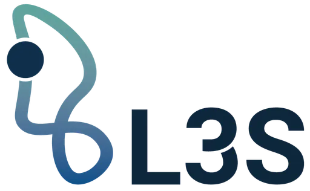
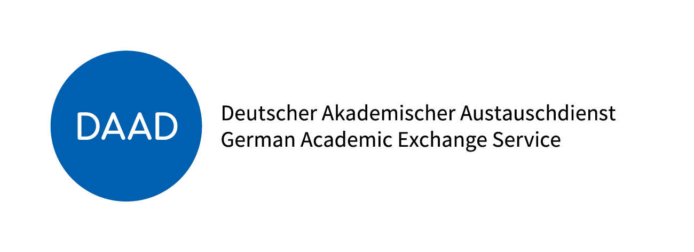

# LGSE: Lexically Grounded Subword Embedding Initialization for Low-Resource Language Adaptation

[](https://github.com/hailaykidu/LGSE-Project-)


### 📣 Accepted at LREC 2026!

<br>

<p align="center">
  
  
</p>

<p align="center">
  
</p>

<p align="center">
  <a href="https://www.linkedin.com/in/hailay-kidu-teklehaymanot-679872328/">Hailay Kidu Teklehaymanot</a>,
  <a href="https://www.linkedin.com/in/drenfazlija">Dren Fazlija</a>,
  <a href="https://www.linkedin.com/in/wolfgangnejdl/">Wolfgang Nejdl</a>
  <br>
  L3S Research Center, Leibniz University Hannover, Germany
</p>

## 📌 Motivation

Adapting pretrained multilingual language models to **low-resource, morphologically rich languages** remains challenging.
Standard vocabulary expansion methods rely on arbitrary subword units, which fragment morphological structure and degrade semantic alignment.

LGSE addresses this by:

1. Decomposing words into linguistically meaningful morphemes.
2. Constructing semantically coherent embeddings via morpheme representation averaging.
3. Applying embedding regularization during LAP to preserve alignment with the original embedding space. 


## 🧠 LGSE Pipeline Overview

1. **Token Selection**
   Identify new vocabulary items for expansion.

2. **Morphological Decomposition**
   Use Amharic + Tigrinya lexicon for segmentation.

3. **Embedding Initialization**

   * Morpheme averaging (FastText or pretrained subwords)
   * Character n-gram fallback

4. **Regularized LAP**

Loss formulation:

```
L_total = L_MLM + lambda * ||E_new − E_init||^2
```

5. **Evaluation**

   * Question Answering
   * Named Entity Recognition
   * Text Classification


## 📊 Experimental Findings

LGSE consistently:

* Outperforms random initialization
* Outperforms subword averaging baselines
* Preserves embedding space alignment
* Improves downstream performance in low-resource settings

Best improvements observed in:

* Morphologically productive suffixes
* Derivational morphology
* Negation constructions


## 📚 Supported Languages

* Amharic
* Tigrinya

Designed for extension to:

* Other Geez-script languages
* Morphologically rich, low-resource languages
* Hebrew, Arab 
* Other Semitic languages
  


## Citation
```bibtex
@inproceedings{teklehaymanot-etal-2026-lgse,
  title={LGSE: Lexically Grounded Subword Embedding Initialization for Low-Resource Language Adaptation},
  author={Teklehaymanot, Hailay Kidu and Fazlija, Dren and Nejdl, Wolfgang},
  booktitle={Proceedings of the Fifteenth Language Resources and Evaluation Conference: LREC 2026},
  year={2026}
}
```
